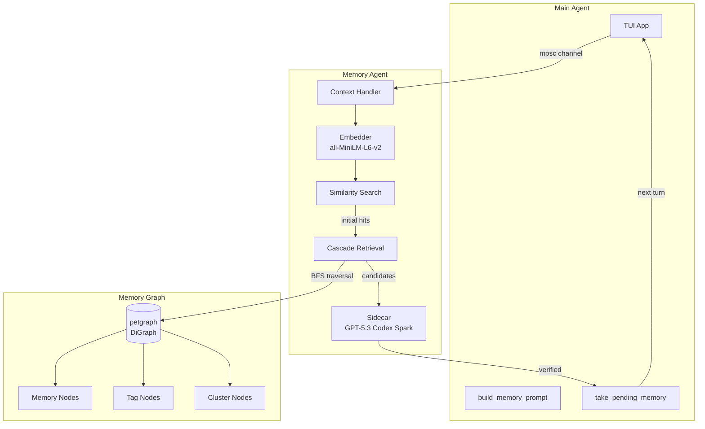
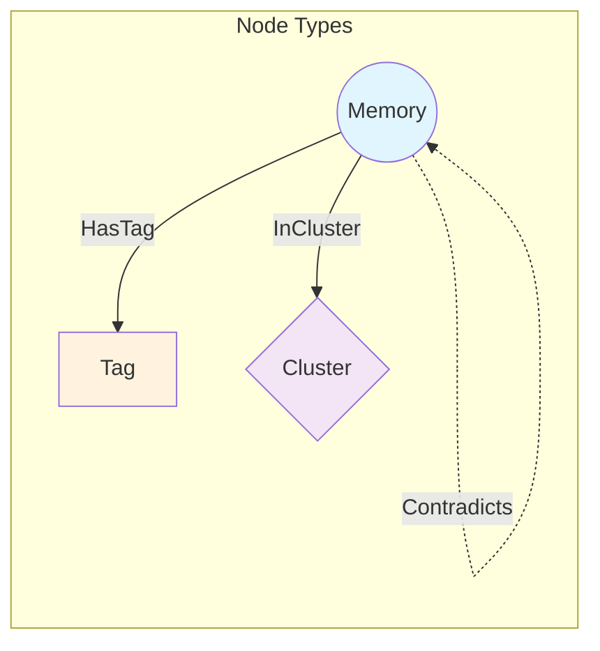
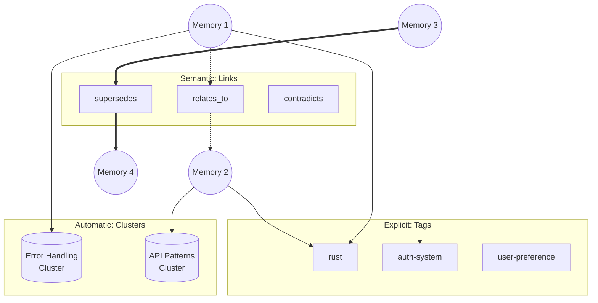
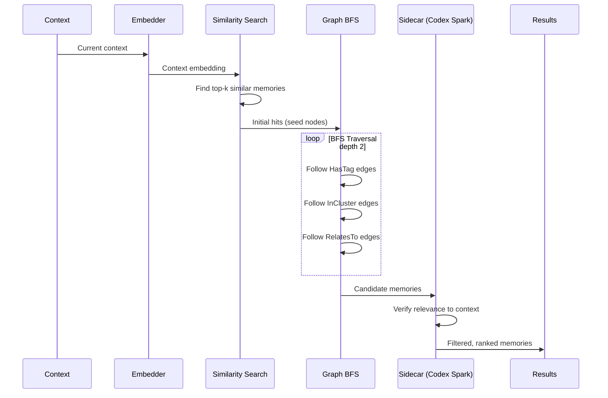
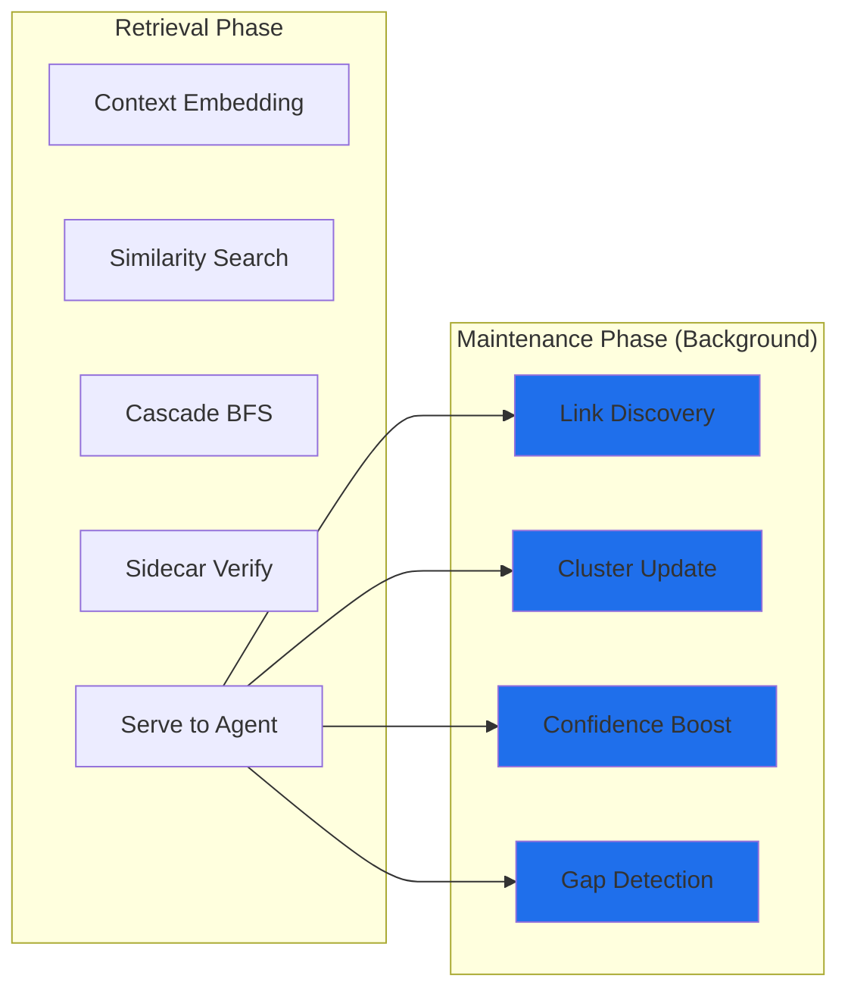
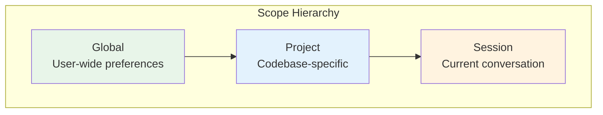
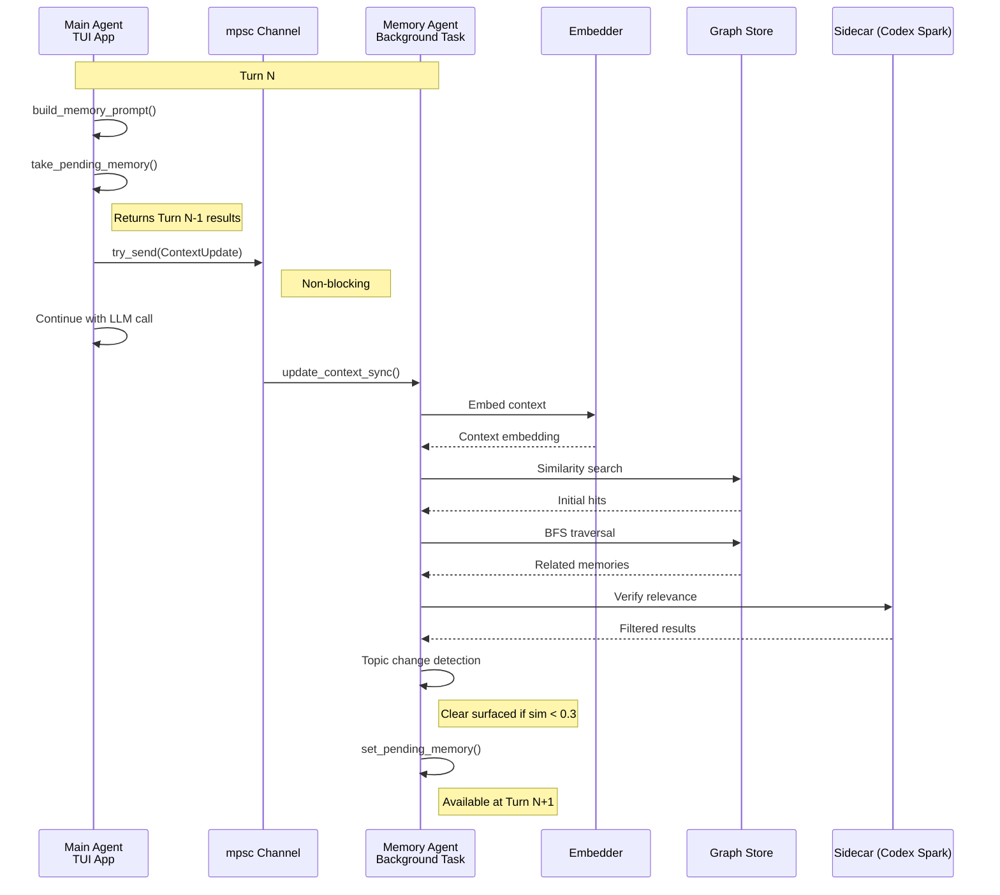
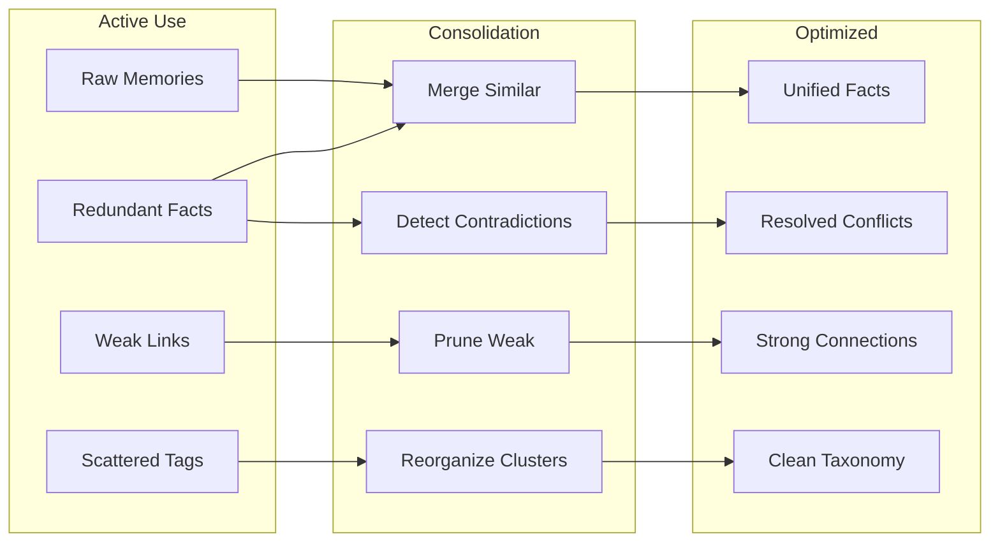

# Memory Architecture Design

> **Status:** Implemented (Core), Planned (Graph-Based Hybrid)
> **Updated:** 2026-01-27

Local embeddings + lightweight sidecar (GPT-5.3 Codex Spark) are implemented and running in production. This document describes both the current implementation and the planned graph-based hybrid architecture.

## Overview

See also: [Memory Regression Budget](./MEMORY_BUDGET.md) for the current measurable guardrails and review expectations.

A multi-layered memory system for cross-session learning that mimics how human memory works - relevant memories "pop up" when triggered by context rather than requiring explicit recall.

**Key Design Decisions:**
1. **Fully async and non-blocking** - The main agent never waits for memory; results from turn N are available at turn N+1
2. **Graph-based organization** - Memories form a connected graph with tags, clusters, and semantic links
3. **Cascade retrieval** - Embedding hits trigger BFS traversal to find related memories
4. **Hybrid grouping** - Combines explicit tags, automatic clusters, and semantic links

---

## Architecture Overview



---

## Graph-Based Data Model

### Node Types



| Node Type | Description | Storage |
|-----------|-------------|---------|
| **Memory** | Core memory entry (fact, preference, procedure) | Content, metadata, embedding |
| **Tag** | Explicit label (user-defined or inferred) | Name, description, count |
| **Cluster** | Automatic grouping via embedding similarity | Centroid embedding, member count |

### Edge Types

| Edge Type | From → To | Description |
|-----------|-----------|-------------|
| `HasTag` | Memory → Tag | Memory has this explicit tag |
| `InCluster` | Memory → Cluster | Memory belongs to auto-discovered cluster |
| `RelatesTo` | Memory → Memory | Semantic relationship (weighted) |
| `Supersedes` | Memory → Memory | Newer memory replaces older |
| `Contradicts` | Memory → Memory | Conflicting information |
| `DerivedFrom` | Memory → Memory | Procedural knowledge derived from facts |

### Rust Implementation

```rust
use petgraph::graph::DiGraph;

/// Node in the memory graph
#[derive(Debug, Clone)]
pub enum MemoryNode {
    Memory(MemoryEntry),
    Tag(TagEntry),
    Cluster(ClusterEntry),
}

/// Edge relationships
#[derive(Debug, Clone)]
pub enum EdgeKind {
    HasTag,
    InCluster,
    RelatesTo { weight: f32 },
    Supersedes,
    Contradicts,
    DerivedFrom,
}

/// The memory graph
pub struct MemoryGraph {
    graph: DiGraph<MemoryNode, EdgeKind>,
    // Indexes for fast lookup
    memory_index: HashMap<String, NodeIndex>,
    tag_index: HashMap<String, NodeIndex>,
    cluster_index: HashMap<String, NodeIndex>,
}
```

---

## Hybrid Grouping System

The memory system uses three complementary organization methods:



### 1. Tags (Explicit)

User-defined or automatically inferred labels.

**Sources:**
- User explicitly tags: `memory { action: "remember", tags: ["rust", "auth"] }`
- Inferred from context (file paths, topics, entities)
- Extracted by sidecar during end-of-session processing

**Examples:**
- `#project:jcode` - Project-specific
- `#rust`, `#python` - Language-specific
- `#auth`, `#database` - Domain-specific
- `#preference`, `#correction` - Category tags

### 2. Clusters (Automatic)

Automatically discovered groupings based on embedding similarity.

**Algorithm:**
1. Periodically run HDBSCAN on memory embeddings
2. Create/update cluster nodes for dense regions
3. Assign `InCluster` edges to nearby memories
4. Track cluster centroids for fast lookup

**Benefits:**
- Discovers hidden patterns user didn't explicitly tag
- Groups related memories even without shared tags
- Enables "find similar" queries

### 3. Links (Semantic Relationships)

Explicit relationships between memories.

**Types:**
- **RelatesTo**: General semantic connection (weighted 0.0-1.0)
- **Supersedes**: Newer information replaces older
- **Contradicts**: Conflicting information (both kept, flagged)
- **DerivedFrom**: Procedural knowledge derived from facts

**Discovery:**
- Contradiction detection on write
- Sidecar identifies relationships during verification
- User can explicitly link memories

---

## Cascade Retrieval

When context triggers memory search, cascade retrieval finds related memories through graph traversal.



### Algorithm

```rust
pub fn cascade_retrieve(
    &self,
    context_embedding: &[f32],
    max_depth: usize,
    max_results: usize,
) -> Vec<(MemoryEntry, f32)> {
    // Step 1: Embedding similarity search
    let initial_hits = self.similarity_search(context_embedding, 10);

    // Step 2: BFS traversal from hits
    let mut visited: HashSet<NodeIndex> = HashSet::new();
    let mut candidates: Vec<(NodeIndex, f32, usize)> = Vec::new();
    let mut queue: VecDeque<(NodeIndex, usize)> = VecDeque::new();

    for (node, score) in initial_hits {
        queue.push_back((node, 0));
        candidates.push((node, score, 0));
    }

    while let Some((node, depth)) = queue.pop_front() {
        if depth >= max_depth || visited.contains(&node) {
            continue;
        }
        visited.insert(node);

        // Traverse edges
        for edge in self.graph.edges(node) {
            let neighbor = edge.target();
            if visited.contains(&neighbor) {
                continue;
            }

            let edge_weight = match edge.weight() {
                EdgeKind::HasTag => 0.8,        // Strong signal
                EdgeKind::InCluster => 0.6,     // Medium signal
                EdgeKind::RelatesTo { weight } => *weight,
                EdgeKind::Supersedes => 0.9,    // Very relevant
                _ => 0.3,
            };

            // Decay score by depth
            let decayed_score = edge_weight * (0.7_f32).powi(depth as i32 + 1);

            if let MemoryNode::Memory(_) = &self.graph[neighbor] {
                candidates.push((neighbor, decayed_score, depth + 1));
            }

            queue.push_back((neighbor, depth + 1));
        }
    }

    // Step 3: Dedupe, sort, and return top results
    candidates.sort_by(|a, b| b.1.partial_cmp(&a.1).unwrap());
    candidates.into_iter()
        .filter_map(|(node, score, _)| {
            if let MemoryNode::Memory(entry) = &self.graph[node] {
                Some((entry.clone(), score))
            } else {
                None
            }
        })
        .take(max_results)
        .collect()
}
```

### Retrieval Parameters

| Parameter | Default | Description |
|-----------|---------|-------------|
| `similarity_threshold` | 0.4 | Minimum embedding similarity for initial hits |
| `max_initial_hits` | 10 | Number of embedding search results |
| `max_depth` | 2 | BFS traversal depth limit |
| `max_results` | 10 | Final results to return |
| `edge_decay` | 0.7 | Score decay per traversal step |

---

## Memory Entry Schema

```rust
#[derive(Debug, Clone, Serialize, Deserialize)]
pub struct MemoryEntry {
    // Identity
    pub id: String,
    pub content: String,
    pub category: MemoryCategory,

    // Classification
    pub memory_type: MemoryType,  // Fact, Preference, Procedure, Correction
    pub scope: MemoryScope,       // Global, Project, Session

    // Source tracking
    pub session_id: Option<String>,
    pub message_range: Option<(u32, u32)>,
    pub file_paths: Vec<String>,
    pub provenance: Provenance,   // UserStated, Observed, Inferred

    // Lifecycle
    pub created_at: DateTime<Utc>,
    pub updated_at: DateTime<Utc>,
    pub last_accessed: DateTime<Utc>,
    pub access_count: u32,
    pub strength: u32,            // Consolidation count

    // Trust & status
    pub confidence: f32,          // 0.0-1.0, decays over time
    pub trust_score: f32,         // Source-based trust
    pub active: bool,
    pub superseded_by: Option<String>,

    // Embedding
    pub embedding: Option<Vec<f32>>,
}

#[derive(Debug, Clone, Serialize, Deserialize)]
pub enum MemoryType {
    Fact,        // "This project uses PostgreSQL"
    Preference,  // "User prefers 4-space indentation"
    Procedure,   // "To deploy: run make deploy"
    Correction,  // "Don't use deprecated API"
    Negative,    // "Never commit .env files"
}

#[derive(Debug, Clone, Serialize, Deserialize)]
pub enum Provenance {
    UserStated,     // User explicitly said it
    UserCorrected,  // User corrected agent behavior
    Observed,       // Agent observed from behavior
    Inferred,       // Agent inferred from context
    Extracted,      // Extracted from session summary
}
```

---

## Advanced Features

### 1. Temporal Awareness

Memories have temporal context:

```rust
pub struct TemporalContext {
    pub session_scope: bool,      // Only relevant in session
    pub recency_weight: f32,      // Recent access boost
    pub seasonal: Option<String>, // "end-of-sprint", "release-week"
}
```

**Recency boost formula:**
```
boost = 1.0 + (0.5 * e^(-hours_since_access / 24))
```

### 2. Confidence Decay

Confidence decays over time based on memory type:

| Memory Type | Half-life | Rationale |
|-------------|-----------|-----------|
| Correction | 365 days | User corrections are high value |
| Preference | 90 days | Preferences may evolve |
| Fact | 30 days | Codebase facts can become stale |
| Procedure | 60 days | Procedures change less often |
| Inferred | 7 days | Low-confidence inferences |

**Decay formula:**
```
confidence = initial_confidence * e^(-age_days / half_life)
           * (1 + 0.1 * log(access_count + 1))
           * trust_weight
```

### 3. Negative Memories

Things the agent should avoid doing:

```rust
MemoryEntry {
    content: "Never use println! for logging in production code",
    memory_type: MemoryType::Negative,
    trigger_patterns: vec!["println!", "print!", "dbg!"],
    ...
}
```

**Surfacing:** Negative memories are surfaced when trigger patterns match current context.

### 4. Procedural Memories

How-to knowledge with structured steps:

```rust
pub struct Procedure {
    pub name: String,
    pub trigger: String,        // "deploy to production"
    pub steps: Vec<String>,
    pub prerequisites: Vec<String>,
    pub warnings: Vec<String>,
}
```

### 5. Provenance Tracking

Every memory tracks its source:

```rust
pub struct ProvenanceChain {
    pub source: Provenance,
    pub session_id: String,
    pub timestamp: DateTime<Utc>,
    pub context_snippet: String,  // What was being discussed
    pub confidence_reason: String, // Why this confidence level
}
```

### 6. Feedback Loops

Memories strengthen or weaken based on use:

```rust
impl MemoryEntry {
    pub fn on_used(&mut self, helpful: bool) {
        self.access_count += 1;
        self.last_accessed = Utc::now();

        if helpful {
            self.strength = self.strength.saturating_add(1);
            self.confidence = (self.confidence + 0.05).min(1.0);
        } else {
            self.confidence = (self.confidence - 0.1).max(0.0);
        }
    }
}
```

### 7. Post-Retrieval Maintenance

After serving memories to the main agent, the memory agent has valuable context it can use for background maintenance. This "opportunistic maintenance" happens asynchronously without blocking.



**Available Context:**
- Current context embedding
- All memories that were retrieved (initial hits + BFS expansion)
- Which memories passed sidecar verification (actually relevant)
- Which were rejected (retrieved but not relevant)
- Co-occurrence patterns (memories that appear together)

**Maintenance Tasks:**

| Task | Trigger | Action |
|------|---------|--------|
| **Link Discovery** | 2+ memories verified relevant | Create/strengthen `RelatesTo` edges between co-relevant memories |
| **Cluster Refinement** | Retrieved memories span clusters | Update cluster centroids, consider merging nearby clusters |
| **Confidence Boost** | Memory verified relevant | Increment access count, boost confidence |
| **Confidence Decay** | Memory retrieved but rejected | Slightly decay confidence (may be stale) |
| **Gap Detection** | Context has no relevant memories | Log potential memory gap for later extraction |
| **Tag Inference** | Multiple memories share context | Infer common tag from context if none exists |

**Implementation:**

```rust
impl MemoryAgent {
    /// Called after serving memories, runs maintenance in background
    async fn post_retrieval_maintenance(&self, ctx: RetrievalContext) {
        // Don't block - spawn maintenance tasks
        tokio::spawn(async move {
            // 1. Strengthen links between co-relevant memories
            if ctx.verified_memories.len() >= 2 {
                self.discover_links(&ctx.verified_memories, &ctx.embedding).await;
            }

            // 2. Boost confidence for verified memories
            for mem_id in &ctx.verified_memories {
                self.boost_confidence(mem_id).await;
            }

            // 3. Decay confidence for rejected memories
            for mem_id in &ctx.rejected_memories {
                self.decay_confidence(mem_id, 0.02).await;  // Gentle decay
            }

            // 4. Detect gaps (context had no relevant memories)
            if ctx.verified_memories.is_empty() && ctx.initial_hits > 0 {
                self.log_memory_gap(&ctx.embedding, &ctx.context_snippet).await;
            }

            // 5. Periodic cluster update (every N retrievals)
            if self.retrieval_count.fetch_add(1, Ordering::Relaxed) % 50 == 0 {
                self.update_clusters().await;
            }
        });
    }
}
```

**Gap Detection for Future Learning:**

When retrieval finds no relevant memories but the context seems important, log it:

```rust
struct MemoryGap {
    context_embedding: Vec<f32>,
    context_snippet: String,
    timestamp: DateTime<Utc>,
    session_id: String,
}
```

These gaps can be reviewed during end-of-session extraction to create new memories for topics the system didn't know about.

### 8. Scope Levels

Memories exist at different scopes:



| Scope | Lifetime | Examples |
|-------|----------|----------|
| Global | Permanent | "User prefers vim keybindings" |
| Project | Until deleted | "This project uses async/await" |
| Session | Current session | "Working on auth refactor" |

---

## Async Processing Pipeline



**Key Points:**
- Memory agent is a **singleton** (OnceCell) - only one instance ever runs
- Communication is **non-blocking** via `try_send()` on mpsc channel
- Results arrive **one turn behind** (processed in background)
- **Topic change detection** resets surfaced set when conversation shifts
- **Cascade retrieval** traverses graph for related memories

---

## Storage Layout

```
~/.jcode/memory/
├── graph.json                    # Serialized petgraph
├── projects/
│   └── <project_hash>.json       # Per-directory memories
├── global.json                   # User-wide memories
├── embeddings/
│   └── <memory_id>.vec           # Embedding vectors
├── clusters/
│   └── cluster_metadata.json     # Cluster centroids and metadata
└── tags/
    └── tag_index.json            # Tag → memory mappings
```

---

## Memory Tools

Available to the main agent:

```
memory { action: "remember", content: "...", category: "fact|preference|correction",
         scope: "project|global", tags: ["tag1", "tag2"] }
memory { action: "recall" }                    # Get relevant memories for context
memory { action: "search", query: "..." }      # Semantic search
memory { action: "list", tag: "..." }          # List by tag
memory { action: "forget", id: "..." }         # Deactivate memory
memory { action: "link", from: "id1", to: "id2", relation: "relates_to" }
memory { action: "tag", id: "...", tags: ["new", "tags"] }
```

---

## Implementation Status

### Phase 1: Basic Memory Tools ✅
- [x] Memory store with file persistence
- [x] Basic memory tool
- [x] Integration with agent

### Phase 2: Embedding Search ✅
- [x] Local all-MiniLM-L6-v2 via tract-onnx
- [x] Background embedding process
- [x] Similarity search with cosine distance

### Phase 3: Memory Agent ✅
- [x] Async channel communication
- [x] Lightweight sidecar for relevance verification (currently GPT-5.3 Codex Spark)
- [x] Topic change detection
- [x] Surfaced memory tracking

### Phase 4: Graph-Based Architecture ✅
- [x] HashMap-based graph structure (simpler than petgraph for JSON serialization)
- [x] Tag nodes and HasTag edges
- [x] Cluster discovery and InCluster edges
- [x] Semantic link edges (RelatesTo)
- [x] Cascade retrieval algorithm with BFS traversal

### Phase 5: Post-Retrieval Maintenance ✅
- [x] Link discovery (co-relevant memories)
- [x] Confidence boost/decay on retrieval
- [x] Gap detection for missing knowledge
- [x] Periodic cluster refinement
- [x] Tag inference from context

### Phase 6: Advanced Features ✅
- [x] Confidence decay system (time-based with category-specific half-lives)
- [ ] Negative memories and trigger patterns
- [ ] Procedural memory support
- [x] Provenance tracking
- [x] Feedback loops (boost on use, decay on rejection)
- [ ] Temporal awareness

### Phase 7: Full Integration ✅
- [x] End-of-session extraction
- [x] Sidecar consolidation on write (see below)
- [x] User control CLI (`jcode memory` commands)
- [x] Memory export/import

### Phase 7.5: Sidecar Consolidation (Inline, Per-Turn) ✅

Lightweight consolidation that runs in the memory sidecar after returning results to the main agent. Only operates on memories already retrieved — no extra lookups, zero added latency.

`extract_from_context()` now performs inline write-time consolidation:

- [x] **Duplicate detection on write** — semantically similar memories are reinforced instead of duplicated.
- [x] **Contradiction detection on write** — contradictory memories are superseded during incremental extraction.
- [x] **Reinforcement provenance** — `MemoryEntry` tracks `Vec<Reinforcement>` breadcrumbs (`session_id`, `message_index`, `timestamp`).

### Phase 8: Deep Memory Consolidation (Ambient Garden) 📋

Full graph-wide consolidation that runs during ambient mode background cycles. See [AMBIENT_MODE.md](./AMBIENT_MODE.md) for the ambient mode design.

- [ ] Graph-wide similarity-based memory merging
- [ ] Redundancy detection and deduplication (beyond sidecar's local scope)
- [ ] Contradiction resolution (across full graph, not just retrieved set)
- [ ] Fact verification against codebase (check if factual memories are still true)
- [ ] Retroactive session extraction (crashed/missed sessions)
- [ ] Cluster reorganization
- [ ] Weak memory pruning (confidence < 0.05 AND strength <= 1)
- [ ] Relationship discovery across sessions
- [ ] Embedding backfill for memories missing embeddings
- [ ] Knowledge graph optimization

---

## Privacy & Security

### Do Not Remember
- API keys, secrets, credentials
- Passwords or tokens
- Personal identifying information
- File contents marked sensitive

### Filtering
Before storing any memory, scan for:
- Regex patterns for secrets (API keys, passwords)
- Files in `.gitignore` or `.secretsignore`
- Content from `.env` files

### User Control
- All memories stored in human-readable JSON
- CLI for viewing/editing/deleting
- Option to disable memory entirely
- Export/import for backup

---

## Future: Memory Consolidation (Sleep-Like Processing)

> **Status:** TODO - Design pending

Similar to how humans consolidate memories during sleep, jcode can run background consolidation to optimize the memory graph:

### Concept



### Potential Features

| Feature | Description |
|---------|-------------|
| **Similarity Merge** | Combine memories with >0.95 embedding similarity |
| **Redundancy Detection** | Find memories that express the same fact differently |
| **Contradiction Resolution** | Surface conflicting memories for user decision |
| **Weak Pruning** | Remove memories with low confidence + low access |
| **Cluster Optimization** | Re-run clustering, merge small clusters |
| **Link Strengthening** | Increase weights on frequently co-accessed pairs |
| **Tag Cleanup** | Merge similar tags, remove orphans |

### Architecture Options (TBD)

1. **Periodic daemon** - Run consolidation every N hours
2. **On-idle trigger** - Run when no active sessions for M minutes
3. **Capacity-based** - Run when memory count exceeds threshold
4. **Manual command** - User-triggered via `/consolidate`

### Open Questions for Consolidation

- How to handle user confirmation for destructive merges?
- Should consolidation be reversible?
- What's the right frequency/trigger?
- How to balance between "perfect organization" and "keep everything"?

---

## Open Questions

1. **Multi-machine sync:** Should memories sync across devices via encrypted backup?
2. **Team sharing:** Should some memories be shareable across a team?
3. **Cluster algorithm:** HDBSCAN vs k-means vs hierarchical clustering?
4. **Graph persistence:** JSON serialization vs SQLite for larger graphs?

---

*Last updated: 2026-01-27*
