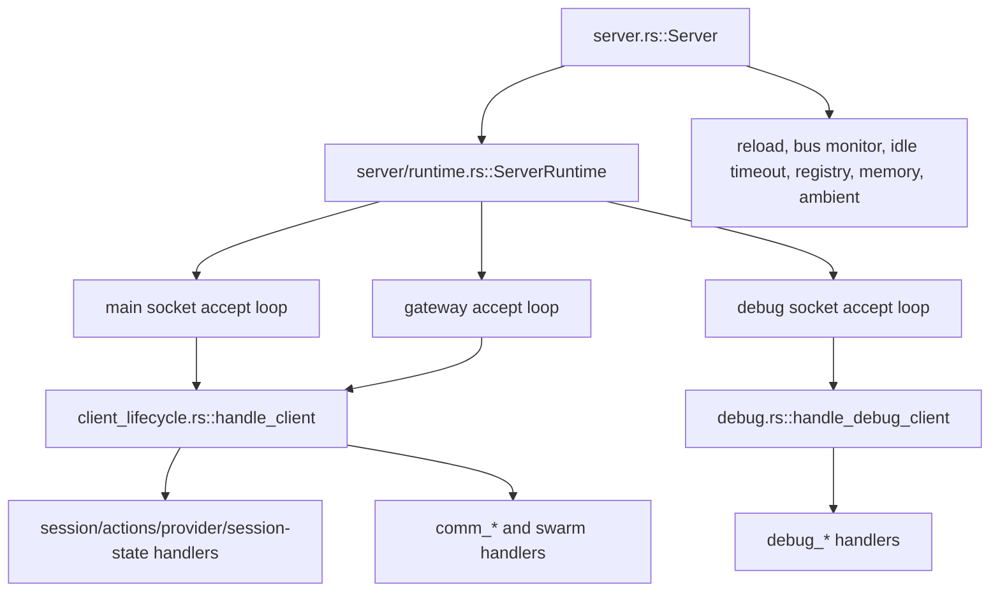
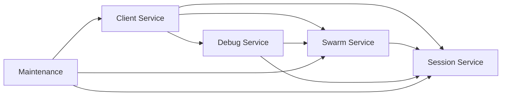

# Server Service Split Plan

Status: Audit-based plan

Scope: `src/server*.rs` and `src/server/**/*.rs` in the current shared-server architecture.

This document audits the current server stack and proposes an incremental split into five in-process services:

- session
- client
- swarm
- debug
- maintenance

The intent is to improve ownership boundaries and reduce argument fanout without changing the single-process runtime model.

See also:

- [`SERVER_ARCHITECTURE.md`](./SERVER_ARCHITECTURE.md)
- [`SWARM_ARCHITECTURE.md`](./SWARM_ARCHITECTURE.md)
- [`UNIFIED_SELFDEV_SERVER_PLAN.md`](./UNIFIED_SELFDEV_SERVER_PLAN.md)

## Executive Summary

Today the server is already logically split by file, but not by ownership boundary.
The dominant pattern is:

- `Server` owns nearly all shared state in one struct.
- `ServerRuntime` clones that full state bag into connection handlers.
- `handle_client()` and `handle_debug_client()` receive very wide dependency lists.
- maintenance loops in `server.rs` mutate the same raw maps used by client, session, swarm, and debug paths.

That means the main extraction seam is **not** transport or process boundaries. The main seam is introducing **service-owned state + service APIs** inside the existing process.

The safest path is:

1. keep one server process
2. keep current modules and behavior
3. introduce service handle structs around existing state
4. move mutation behind service methods
5. reduce `handle_client()` and `handle_debug_client()` to a few service/context arguments

Do **not** start with crates, traits, or IPC splits. The code is not ready for that yet, and the current pain is mostly ownership fanout, not runtime topology.

## Current Stack Audit

### Top-level runtime shape

Current runtime flow:



### Shared state concentration

`src/server.rs` owns one large `Server` struct with state spanning all concerns, including:

- sessions and default session id
- client count and client connection map
- swarm membership, plans, shared context, coordinator map
- file touch tracking and reverse indexes
- channel subscriptions and reverse indexes
- debug client routing and debug jobs
- swarm event history and event bus
- ambient runner, shared MCP pool
- shutdown signals and soft interrupt queues
- await-members runtime

This is a service container in practice, but it is represented as one broad state owner.

### Existing positive seams

The code already contains a few useful seams we should preserve:

- `runtime.rs` already isolates accept-loop orchestration from bootstrap.
- `state.rs` already centralizes shared types and delivery helpers.
- `swarm.rs` is already the closest thing to a stateful domain service.
- `reload.rs` is already separate from bootstrap, even though `server.rs` still owns most maintenance wiring.
- `debug_*` modules are already split by debug command domain.

These are good extraction points. The plan below leans on them instead of fighting them.

## Module Heat Map

Largest server-side modules at the time of audit:

| File | Lines | Primary concern today | Future service |
|---|---:|---|---|
| `src/server/client_lifecycle.rs` | 1767 | client request loop and router | client |
| `src/server/client_comm.rs` | 1492 | swarm communication requests | swarm |
| `src/server/client_actions.rs` | 1249 | session-local actions | session |
| `src/server/swarm.rs` | 1202 | swarm state mutation and fanout | swarm |
| `src/server/comm_control.rs` | 1183 | swarm control / await-members / client debug bridge | swarm + debug |
| `src/server/client_session.rs` | 1091 | subscribe, resume, clear, reload | session + client boundary |
| `src/server/comm_session.rs` | 987 | spawn/stop session flows | session + swarm boundary |
| `src/server/debug.rs` | 980 | debug socket command router | debug |
| `src/server/reload.rs` | 826 | reload and graceful shutdown | maintenance |
| `src/server/debug_server_state.rs` | 748 | debug snapshots across all stores | debug |

Interpretation:

- The architecture is not blocked on missing modules.
- It is blocked on **cross-service state access** and **router width**.

## Where Coupling Is Highest

### 1. `ServerRuntime` is a full-state courier

`runtime.rs` clones almost every shared field into the runtime and forwards them into:

- main client handling
- debug client handling
- gateway client handling

This makes transport code depend on internal service storage details.

### 2. `handle_client()` is both connection loop and application router

`client_lifecycle.rs::handle_client()` currently combines:

- stream read loop
- per-connection state
- session attach / resume / clear
- provider control
- swarm communication dispatch
- debug bridge requests
- message processing lifecycle
- disconnect cleanup

That is the clearest signal that client, session, swarm, and debug responsibilities are crossing in one place.

### 3. session flows directly mutate swarm state

`client_session.rs` does real session work, but also directly touches:

- swarm member registration
- channel subscription cleanup
- plan participant rename/removal
- status updates
- event sender registration
- interrupt queue rename/removal

That makes session lifecycle hard to extract cleanly because it owns both agent state and swarm membership side effects.

### 4. maintenance loops reach into domain maps directly

`server.rs` maintenance tasks currently touch shared state directly for:

- reload handling
- background task wakeup / notification delivery
- bus monitoring and file touch conflict detection
- idle timeout
- runtime memory logging
- registry publishing
- ambient scheduling

This makes background jobs depend on storage layout instead of service APIs.

### 5. debug paths bypass future boundaries

`debug.rs` and `debug_*` modules inspect or mutate many raw stores directly.
That is fine for now, but it will block extraction unless debug becomes a consumer of service snapshots and public mutation methods.

## Proposed Service Split

The target split is still one process and one Tokio runtime.
The change is ownership and APIs, not deployment.

### 1. Session Service

**Owns:**

- `sessions`
- `session_id` default/global session tracking
- `shutdown_signals`
- `soft_interrupt_queues`
- session event sender registration and fanout
- session-local agent actions and provider/session mutation
- headless session creation primitives

**Primary modules after split:**

- `state.rs` delivery pieces
- `client_session.rs` session-only parts
- `client_actions.rs`
- `provider_control.rs`
- `headless.rs`
- parts of `reload.rs` for graceful shutdown helpers

**Public API examples:**

- `attach_client(...)`
- `resume_session(...)`
- `clear_session(...)`
- `spawn_headless_session(...)`
- `queue_soft_interrupt(...)`
- `fanout_session_event(...)`
- `rename_session(...)`
- `shutdown_session(...)`
- `session_snapshot(...)`

**Boundary rule:** session service should not directly own swarm membership rules.
It can expose lifecycle events or return session metadata that another layer uses to update swarm state.

### 2. Client Service

**Owns:**

- socket, debug socket, gateway transport accept loops
- client connection registry
- client count / attachment count
- connection-scoped state and request routing
- subscribe / reconnect orchestration across services
- client API wrappers

**Primary modules after split:**

- `runtime.rs`
- `socket.rs`
- `client_api.rs`
- `client_lifecycle.rs` connection loop and router only
- `client_disconnect_cleanup.rs`
- client-facing parts of `client_state.rs`

**Public API examples:**

- `spawn_accept_loops(...)`
- `run_client_connection(stream)`
- `register_connection(...)`
- `cleanup_connection(...)`
- `connected_clients_snapshot()`

**Boundary rule:** client service routes requests, but does not own business state for sessions, swarms, or debug jobs.

### 3. Swarm Service

**Owns:**

- `swarm_members`
- `swarms_by_id`
- `shared_context`
- `swarm_plans`
- `swarm_coordinators`
- channel subscriptions and reverse indexes
- swarm event history and event broadcast
- file touch tracking and reverse indexes
- await-members runtime
- status broadcasting, plan broadcasting, conflict notifications

**Primary modules after split:**

- `swarm.rs`
- `client_comm.rs`
- `comm_plan.rs`
- `comm_control.rs` swarm portions
- `comm_session.rs` swarm coordination portions
- `comm_sync.rs`
- file-touch portions of `server.rs::monitor_bus`
- `await_members_state.rs`

**Public API examples:**

- `join_swarm(...)`
- `leave_swarm(...)`
- `set_member_status(...)`
- `assign_role(...)`
- `update_plan(...)`
- `subscribe_channel(...)`
- `publish_notification(...)`
- `record_file_touch(...)`
- `detect_conflicts(...)`
- `await_members(...)`
- `snapshot_swarm(...)`

**Boundary rule:** swarm service can request message delivery through the session service, but should not reach into raw session maps.

### 4. Debug Service

**Owns:**

- debug socket request router
- client debug bridge state
- debug job registry
- testers and debug command execution helpers
- server and swarm snapshots for inspection

**Primary modules after split:**

- `debug.rs`
- `debug_command_exec.rs`
- `debug_events.rs`
- `debug_help.rs`
- `debug_jobs.rs`
- `debug_server_state.rs`
- `debug_session_admin.rs`
- `debug_swarm_read.rs`
- `debug_swarm_write.rs`
- `debug_testers.rs`
- `debug_ambient.rs`

**Public API examples:**

- `run_debug_connection(stream)`
- `submit_debug_job(...)`
- `server_snapshot()`
- `swarm_snapshot(...)`
- `route_transcript_injection(...)`

**Boundary rule:** debug service should read snapshots from other services and mutate them only through explicit service methods.
It should not be a privileged backdoor around normal APIs except where intentionally documented.

### 5. Maintenance Service

**Owns:**

- reload monitor and reload-state plumbing
- registry publish / cleanup background tasks
- idle timeout monitor
- runtime memory logging loop
- embedding preload and idle unload
- ambient loop startup/wiring
- background task completion delivery orchestration
- bus subscription loops that translate infra events into service calls

**Primary modules after split:**

- `reload.rs`
- `reload_state.rs`
- background-task delivery logic from `server.rs`
- registry and idle-timeout pieces from `server.rs`
- runtime memory logging pieces from `server.rs`
- `monitor_bus()` after it is narrowed to service calls

**Public API examples:**

- `start_background_loops(...)`
- `handle_reload_signal(...)`
- `deliver_background_task_completion(...)`
- `publish_registry_metadata(...)`
- `run_idle_monitor(...)`
- `run_bus_monitor(...)`

**Boundary rule:** maintenance service should orchestrate services, not own their domain maps.

## Recommended Dependency Direction



Rules:

- `Server` becomes bootstrap and wiring only.
- `ServerRuntime` becomes transport runtime only.
- session and swarm are the main domain services.
- debug and maintenance depend on domain services, not the other way around.

## Concrete Extraction Seams

### Seam A: turn `state.rs` into the session-delivery foundation

`state.rs` already contains the best low-risk shared seam:

- session event sender registration
- session event fanout
- soft interrupt queue registration and enqueue

Make this the initial backbone of the session service instead of leaving it as generic helpers.

Why this is safe:

- logic is already centralized
- heavily reused by swarm, debug, and maintenance
- extraction reduces duplication of `SessionAgents` and queue plumbing without changing behavior

### Seam B: separate connection routing from business handlers

Split `client_lifecycle.rs` into:

- `ClientConnection` or `ClientLoop` for stream handling and per-client state
- `ClientRequestRouter` for mapping `Request` variants to service calls

The router should depend on `SessionService`, `SwarmService`, and `DebugService`, not raw `Arc<RwLock<HashMap<...>>>` fields.

Why this is safe:

- no protocol change
- no state ownership change yet
- mostly signature narrowing and file movement

### Seam C: move swarm membership side effects out of session lifecycle code

Today subscribe/resume/clear paths do both session and swarm work.
That should become:

- session service: attach/resume/rename session
- swarm service: join/update/leave member state
- client service: orchestrate the sequence for a request

This is likely the most important semantic seam for future maintainability.

Why this is safe:

- it clarifies ownership without changing the shared-server model
- it removes the hardest cross-domain coupling first

### Seam D: make maintenance loops call service APIs only

`monitor_bus()`, reload orchestration, idle timeout, and background-task wakeup should stop mutating shared maps directly.
They should call:

- `session_service.queue_soft_interrupt(...)`
- `session_service.fanout_session_event(...)`
- `swarm_service.record_file_touch(...)`
- `swarm_service.broadcast_status(...)`
- `swarm_service.detect_conflicts(...)`

Why this is safe:

- behavior stays the same
- background logic becomes testable in isolation
- future refactors no longer require editing `server.rs`

### Seam E: make debug consume snapshots, not storage

The debug stack currently knows too much about internal maps.
Introduce service snapshot methods so debug code reads pre-shaped data:

- `session_service.snapshot_sessions()`
- `client_service.snapshot_connections()`
- `swarm_service.snapshot_state()`
- `maintenance_service.snapshot_runtime_health()`

Why this is safe:

- debug stays powerful
- domain internals become easier to change
- read-only inspection stops blocking storage changes

## First Safe Moves

These are the first changes I would recommend landing in order.

### Move 1: docs and ownership rules

Land this plan and treat it as the contract for future refactors.

**Why first:** it prevents accidental partial extractions that worsen coupling.

### Move 2: introduce service handle structs with zero behavior change

Add thin wrappers such as:

- `SessionServiceHandle`
- `ClientServiceHandle`
- `SwarmServiceHandle`
- `DebugServiceHandle`
- `MaintenanceServiceHandle`

Initially these can just wrap the current `Arc` fields.
No logic movement is required yet.

**Payoff:** stops the spread of 20+ argument lists.

### Move 3: change `ServerRuntime` to hold service handles, not raw maps

`runtime.rs` is the cleanest place to narrow dependencies because it already acts as the server’s execution runtime.

**Payoff:** connection accept code no longer needs to know the storage layout of every subsystem.

### Move 4: change `handle_client()` and `handle_debug_client()` signatures

Replace wide argument lists with a few typed contexts:

- `ClientRequestContext`
- `DebugRequestContext`
- service handles

**Payoff:** largest readability win with limited behavioral risk.

### Move 5: extract swarm membership orchestration from `client_session.rs`

Create explicit swarm membership methods and have client/session flows call them.

**Payoff:** this is the first real domain split and removes one of the biggest architecture knots.

### Move 6: move `monitor_bus()` behind the swarm/session API boundary

Keep behavior, but stop direct map access from the maintenance loop.

**Payoff:** background infrastructure becomes modular and easier to test.

## Moves To Avoid Early

Avoid these until the service-handle layer exists:

- splitting into separate processes
- creating new crates for each service
- introducing async traits for every domain call
- changing the on-the-wire protocol
- changing session persistence format
- merging debug and normal sockets into one transport path as part of the refactor

These are higher-risk and do not solve the present problem as directly as state/API narrowing.

## Suggested File Landing Plan

### Phase 1: no behavior change

- add service handle types
- make `Server` store those handles or construct them centrally
- thread handles through `runtime.rs`
- narrow `handle_client()` and `handle_debug_client()` inputs

### Phase 2: move ownership boundaries

- move session delivery helpers under session service
- move swarm membership/status/channel/plan mutation fully under swarm service
- move debug readers to service snapshots
- move maintenance loops to service APIs

### Phase 3: clean module layout

Possible end-state layout:

```text
src/server/
  bootstrap.rs            # current server.rs bootstrap pieces
  runtime.rs              # accept loops and transport runtime
  services/
    session.rs
    client.rs
    swarm.rs
    debug.rs
    maintenance.rs
  session/
    actions.rs
    lifecycle.rs
    provider.rs
    delivery.rs
  swarm/
    comm.rs
    plan.rs
    control.rs
    sync.rs
    state.rs
  debug/
    router.rs
    jobs.rs
    snapshots.rs
    testers.rs
  maintenance/
    reload.rs
    bus.rs
    idle.rs
    memory.rs
    registry.rs
```

This can be reached gradually. It does not need to happen in one PR.

## Decision Record

### Recommended first code extraction

If one tiny extraction is desired after docs, the safest one is:

- introduce **service handle structs only**, with no behavior change

That is the highest-leverage low-risk move because it narrows dependency surfaces immediately and creates a place to move methods later.

### Recommended non-goal for now

Do not split the server into separate OS services. The current architecture benefits from shared MCP pool, shared embedding lifecycle, shared reload handling, and shared in-memory coordination. The code should first be made modular **inside** the existing process.
